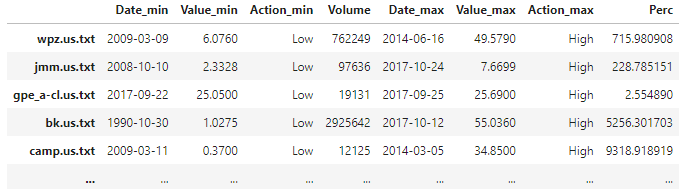

# US Stock Exchange Analysis
## Problem Description

A friend of yours, a physicist, has discovered something very strange: they found a way to perform stock trades
not today (like the rest of the world, pfft), but on any past date they want at the New York Stock Exchange!
Specifically, they discovered an interest-bearing bank account that had 1 dollar in it on 1/1/1960, and a
(nearly) magical way of issuing buy or sell orders for stocks on any day they choose, using the money that exists
in this account. Obviously, buying a stock involves withdrawing money from the account, and selling results in
adding money to the account. Your friend is asking for your help to find a good sequence of trades that will make
them rich. If you help them, they propose to share the profits.

## Goal

Assuming certain assumptions, the objective is to find a sequence of N moves, each of which will be a quadruple
of the form (di, mi, si, xi) for 0 ≤ i < N, where di is the day on which the move will be executed, mi is the
code of the move, si is the code of the stock involved, and xi is the number of shares to be bought or sold.

## Assumptions
> Suppose you've found a way to trade stocks in any date in the past, starting from 1/1/1960 with a bank account of 1$. The goal is to find a sequence of N trades, where N ≤ 100000, that maximizes your profit using a heuristic approach (i.e. avoid reinforcement learning or optimization). The rules are the following:
> - The allowed types of trades (actions) are *buy* and *sell*.
> - Trades can be performed at three distinct time windows within a day: the *open* window, which precedes the *low* and *high* window, which in turn precede the *close* window. All trades have to be performed in chronological order within the same day. For example, you cannot acquire 10 units of one stock at low and sell them at open of the same day.
> - The money used to buy stocks, or the stocks for sale, need to be available before performing each window's trades. For example, you can sell at high 30 units that you bought at open of the same day, however you can't sell them if you bought them at low, since low and high belong in the same time window.
> - The total number of a stock's units bought/sold during a day cannot exceed 10% of the stock's volume during that day.
> - Supposing that before the open window of a day you have n ≥ 0 units of a specific stock, you are not allowed to buy more than n+1 units of this stock during that day. For example, if you have 20 units of AAPL before the open window of a day, then you can buy **at most** 21 units of AAPL during that day, even if you intend to sell them before the close window.

## Results
Some Transactions:

Graphs:

